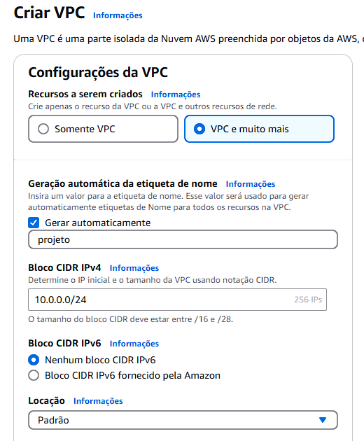
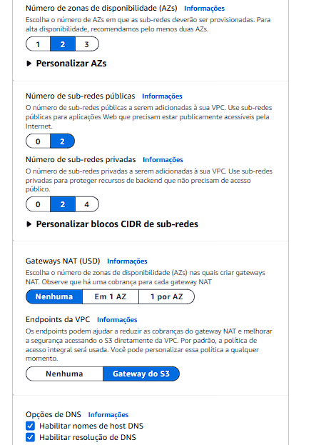
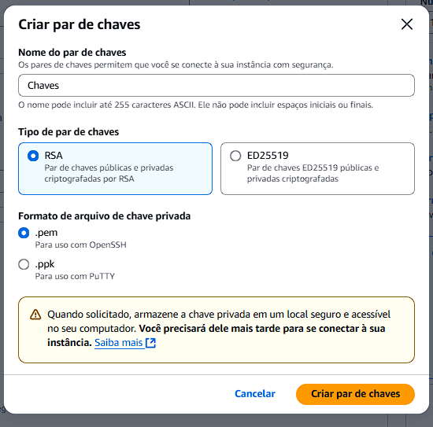
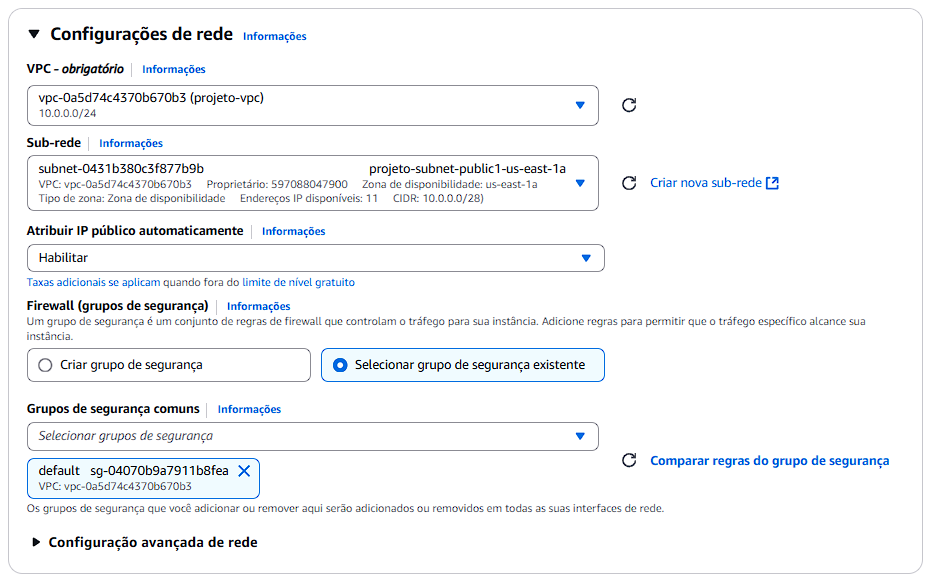

# Projeto1-Nginx

## Sobre o Projeto

Este projeto tem como objetivo configurar um servidor web na AWS com monitoramento automático, utilizando uma instância EC2 com Ubuntu Server 24.04 LTS para instalar o Nginx. Será criada uma VPC com sub-redes públicas e privadas, além de uma página HTML para testes. Para garantir a continuidade e a disponibilidade do serviço, será implementado um script de monitoramento personalizado que verifica o status do Nginx a cada 1 minuto, enviando uma mensagem para o Discord mostrando se está ONLINE ou OFFLINE.

## Sumário


## 1. Configuração do Ambiente Virtual

Para começar, precisamos criar e configurar uma VPC (Virtual Private Cloud) dedicada ao projeto.
 
1. No console AWS, acesse o serviço VPC e clique em **Criar VPC**.

2. O nome da VPC pode ser o que desejar, contudo, as outras opções devem estar iguais as das imagens.





3. Se quiser, pode adicionar tags descritivas à VPC. Isso facilita a identificação dos recursos associados ao projeto.

4. Clique em "**Criar VPC**" e aguarde a criação dos recursos.

## 2. Configuração e Criação da Instância EC2

Criaremos uma instância EC2 utilizando uma AMI do Ubuntu Server 24.04 LTS. Além disso, iremos configurar regras específicas de entrada e saída no grupo de segurança da instância. 

### 2.1 Configuração do Grupo de Segurança 

 1. Na interface do AWS, vá até "EC2" na seção de serviços.

 2. No painel EC2, sob a categoria "Rede e Segurança", clique em "Grupos de segurança".

 3. Encontre o grupo de segurança associado à sua VPC (procure pelo ID da VPC no painel de informações) e clique sobre ele para editar.

 4. No grupo de segurança, clique em "Editar regras de entrada" (Inbound rules).

    -Adicione a seguinte regra para o SSH:
  
    - Tipo: SSH
   
    - Porta: 22
   
    - Origem: Defina como seu endereço IP (use a opção "Meu IP" para preenchê-lo automaticamente).
   
    -Adicione também a regra para o HTTP:
   
    - Tipo: HTTP
   
    - Porta: 80
   
    - Origem: Qualquer IP (0.0.0.0/0).
   
    -Verifique as regras de saída (Outbound rules):
   
    -Mantenha a regra padrão, permitindo tráfego livre para qualquer destino (0.0.0.0/0).

### 2.2 Criação da Instância

1. Na página principal do EC2, clique em "**Executar instância**".

2. Configurações gerais da instância:

    -Na página principal do EC2, clique em "Executar instância" para iniciar o processo de criação.

    -Nas configurações gerais da instância, adicione tags descritivas para melhorar a identificação e o gerenciamento da instância no futuro.

    -Escolha a AMI do Ubuntu Server 24.04 LTS.

    -Para o tipo de instância, selecione a t2.micro. Esse tipo de instância é suficiente para este projeto e está coberto pelo nível gratuito da AWS.

    -Crie um novo par de chaves ou selecione um já existente. Essas chaves serão necessárias para acessar a instância via SSH, por isso devem ser guardadas com segurança.
   
      

3. Configurações de rede da instância:

    - Em "**VPC**", selecione a VPC criada anteriormente para o projeto.

    - Em "**sub-rede**", selecione a sub-rede pública criada com a VPC.

    - Habilite a **atribuição de IP público automaticamente**.

    - Em "**Grupos de segurança comuns**", selecione o grupo de segurança criado com a VPC.

      

4. Mantenha as configurações de armazenamento padrões.

5. Revise as configurações. Caso esteja tudo correto, clique em "**Executar instância**".

### 2.3 Alocação do IP Elástico

1. No painel EC2, na seção "**Rede e Segurança**", navegue até "**IPs elásticos**".

2. Clique em "**Alocar endreço de IP elástico**".

3. Utilize o conjunto de endereços IPv4 da Amazon.

4. Se desejar, adicione tags descritivas associadas ao projeto.

5. Após criado, selecione o IP, clique em "**Ações**" e "**Associar endereço de IP elástico**".

6. Selecione a instância do servidor.

7. Clique em "**Associar**".

## 3. Conectando à Instância

Iremos usar a chave criada para estabelecer uma conexão segura via SSH com a instância.

### Conexão via SSH

1. Abra o terminal no seu computador e use o comando `ssh` para se conectar à sua instancia. Você precisará da localização da chave privada (arquivo .pem), do nome de usuário ("ubuntu" é o nome padrão do usuário) e seu IP público, como no exemplo abaixo:

```bash
ssh -i ~/caminho/da/chave.pem ubuntu@seu-ip-publico-da-ec2
```

2. Na primeira vez que se conectar, você verá um aviso de fingerprint. Aceite digitando "yes" para confirmar que está se conectando ao servidor correto e salvá-lo para futuras conexões seguras. Após a conexão, algumas informações sobre a distribuição Ubuntu serão exibidas, e o prompt do shell deve ser algo como:

```bash 
ubuntu@ip-10-0-0-xx:~$
```

## 4. Instalação e Configuração do Nginx

1. Após se conectar no terminal do Ubuntu, execute o seguinte comando para verificar se não há atualizações a serem feitas:

```bash
sudo apt update && sudo apt upgrade -y
```

2. Instale o Nginx:

```bash
sudo apt install nginx -y
```

3. Verifique o status do Nginx:

```bash
sudo systemctl status nginx
```

4. Para verificar se o servidor está funcionando, abra o navegador e digite o IP público. Se tudo estiver certo, o site deve mostrar a página padrão do nginx:


## 5. Configuração do Diretório do Site

Neste projeto foi utilizado uma página de um site de compras de bicicletas. Os arquivos estão no repositório.
Para implementar uma página customizada no Nginx, implemente os passos a seguir:
 
1. Copie a pasta contendo os arquivos HTML, CSS e imagens do seu computador local para a instância:  
   ```bash
   scp -i chave01.pem -r /home/rogerio/bikcraft ubuntu@IP_PUBLICO_DA_EC2:/home/ubuntu/
   ```
2. Mova os arquivos para o diretório do Nginx:  
   ```bash
   sudo mv /home/ubuntu/bikcraft /var/www/html/
   ```
3. Edite o arquivo de configuração:  
   ```bash
   sudo nano /etc/nginx/sites-available/default
   ```
4. Altere a linha "root" para direcionar ao diretório do site:  
   ```nginx
   root /var/www/html/bikcraft;
   ```
5. Reinicie o Nginx:  
   ```bash
   sudo systemctl restart nginx
   ```
   
Com isso, ao recarregar a página, você já deve ver o seu site customizado no Nginx:


## 6. Configuração do Discord

Para esta etapa, você deve ter um servidor no Discord ou estar em um com permissão para criar e modificar chats.

1. Escolha um chat ou crie um novo.

2. Clique em Editar Canal.

3. Vá em Integrações -> Webhooks.

4. Crie um novo Webhook.


5. Nomeie como desejar e escolha o chat no qual o script irá mandar os alertas.
   
6. Copie a URL do Webhook, ela será adicionada no script.

## 7. Criação e Configuração do Script

1. Crie um arquivo Python para o script.
   
    ```bash
   nano /usr/local/bin/monitoramento.py
   ```
2. Cole o código abaixo:
   ```python
   import requests
   import time

   def enviar_notificacao_discord(mensagem):
       webhook_url = 'https://discordapp.com/api/webhooks/aqui_vai_sua_url_webhook'
       payload = {
           "content": mensagem
       }
   
       try:
           response = requests.post(webhook_url, json=payload)
           if response.status_code == 204:
               print("Notificação enviada para o Discord com sucesso!")
           else:
               print(f"Falha ao enviar notificação para o Discord. Status: {response.status_code}")
       except requests.exceptions.RequestException as e:
           print(f"Erro ao enviar notificação para o Discord: {e}")
   
   def verificar_site(url):
       try:
           resposta = requests.get(url)
           if resposta.status_code == 200:
               enviar_notificacao_discord(f'O site {url} está ONLINE.')
           else:
               enviar_notificacao_discord(f'O site {url} está OFFLINE. Status: {resposta.status_code}')
       except requests.exceptions.RequestException as e:
           print(f'O site está OFFLINE. Erro {e}')
           enviar_notificacao_discord(f'O site {url} está OFFLINE. Erro: {e}')
   
   url = 'http://localhost/'

   while True:
       verificar_site(url)
       time.sleep(60)
   ```
3. Substitua o link webhook pelo que você copiou no Discord e salve o arquivo.
